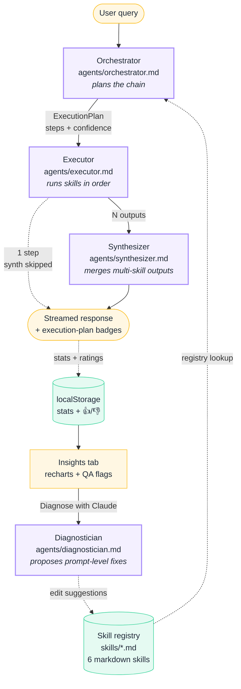

# Pipeline architecture

A user query flows through three agents — **orchestrator** (plans), **executor** (runs), **synthesizer** (merges) — over a markdown-defined skill registry. Responses stream to the UI as NDJSON. Each response writes telemetry + thumb-feedback to `localStorage`; a fourth analyst agent (the **Diagnostician**) reads that telemetry on demand and proposes prompt-level fixes that edit the skill files. That dotted arrow at the bottom of the diagram is the bet: the feedback loop closes inside the product.

## How chaining works inside the executor

Each skill's output is prepended to the next skill's user message as a `## Prior Analysis` block. No shared state, no orchestration framework — just context injection. The chain `Invoice Extractor → Policy Compliance Checker` means the compliance checker receives the user's original query *and* the extractor's structured output, with one fenced block telling it what came before.

Max chain length is 3 to cap latency. The orchestrator returns `{ steps: [{skillId, reason}], confidence, reasoning }`; the synthesizer is **conditional** — single-skill plans skip it (the executor output is returned directly), multi-skill plans merge into one narrative.

## Mapping to Ramp internals

| Ramp internal           | This repo                                                                                                   |
| ----------------------- | ----------------------------------------------------------------------------------------------------------- |
| **Dojo** (skill registry)        | `skills/*.md` — 6 markdown skills, gray-matter frontmatter + system-prompt body. Add a skill = one new file. |
| **Sensei** (reactive routing)    | `agents/orchestrator.md` + `src/lib/orchestrator.ts` — Claude-powered planner returning an `ExecutionPlan`. |
| **Sensei** (proactive surfacing) | `src/lib/roleRecommendations.ts` + `src/components/RoleStrip.tsx` — role chips reorder the marketplace by role-top-3. |
| **Glass / Claude Code**          | Every prompt in this repo is a markdown file an operator can edit (skills, all 4 agents). No prompt is buried in TS. |
| **AI-built dashboards**          | `src/components/InsightsPanel.tsx` (Claude wrote the dashboard) + `agents/diagnostician.md` (Claude is the analyst inside it). |

## The bet (what Dojo doesn't do today)

Single-skill routing leaves compound workflows on the table once the registry passes ~50 skills. This demo shows **automatic chaining**: a query like *"Extract this invoice, categorize the line items, and flag anything non-compliant"* returns a 3-step plan with no user wiring. The orchestrator reads each skill's `chainableAfter` hint from its frontmatter and composes. Composition becomes the next bottleneck, not coverage.
